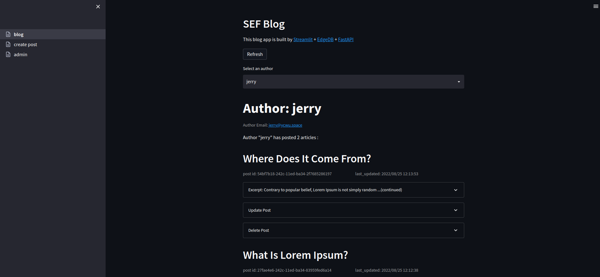
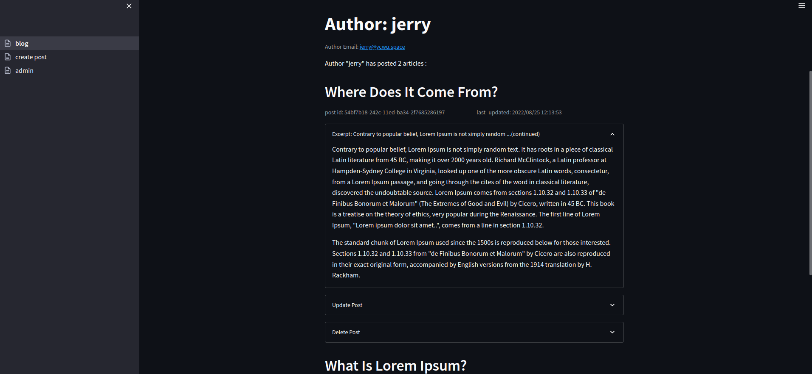
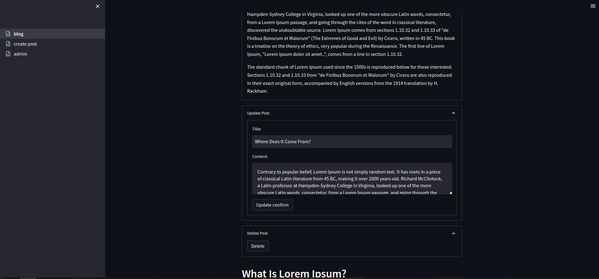
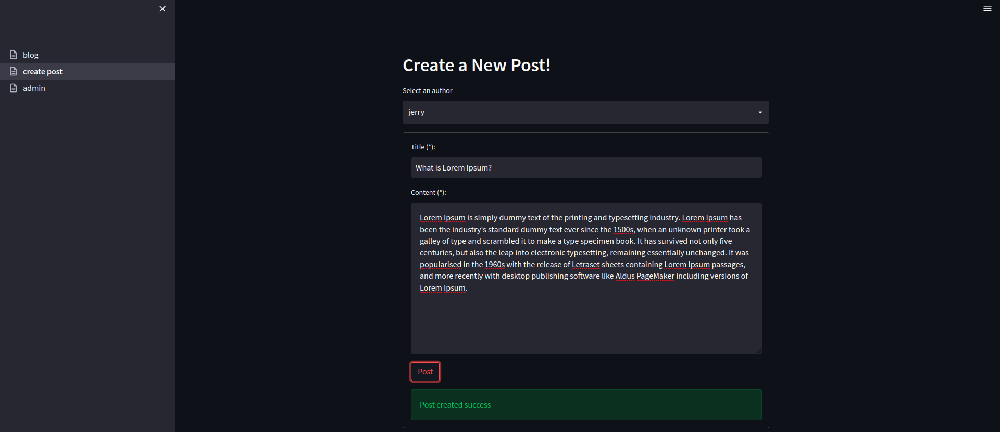
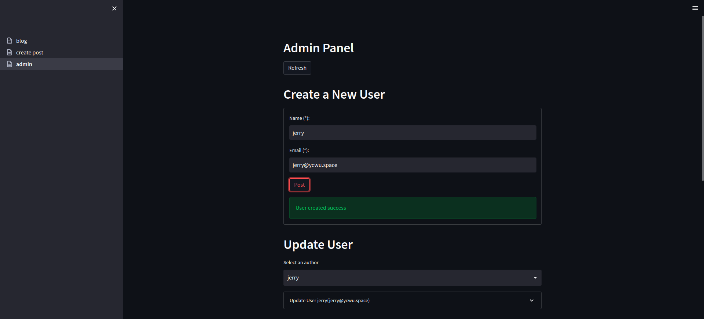
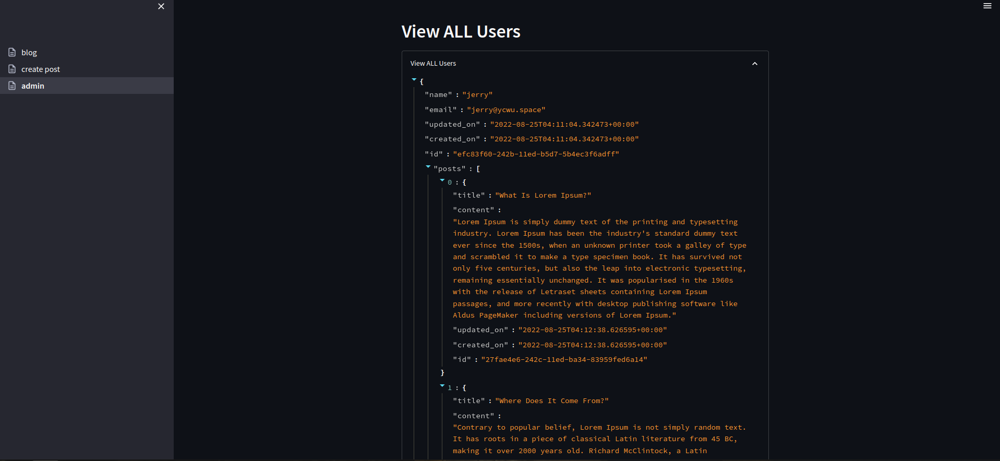

# streamlit-edgedb-fastapi-blog
A simple blog app built by [Streamlit](https://streamlit.io/) + [EdgeDB](https://www.edgedb.com/) + [FastAPI](https://fastapi.tiangolo.com/)

```
pip install -r requirements.txt

# EdgeDB
edgedb project init
edgedb migration create
edgedb migrate

# FastAPI
uvicorn app.main:api

# Streamlit
streamlit run stapp/01_blog.py

# pytest
edgedb instance create test01
edgedb -I test01 migrate
python -m pytest tests/
edgedb instance destroy -I test01 --force
```

## Blog




# Create Post


# Admin



